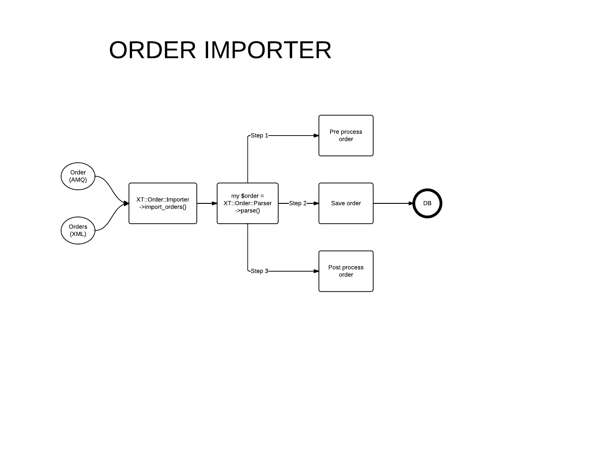
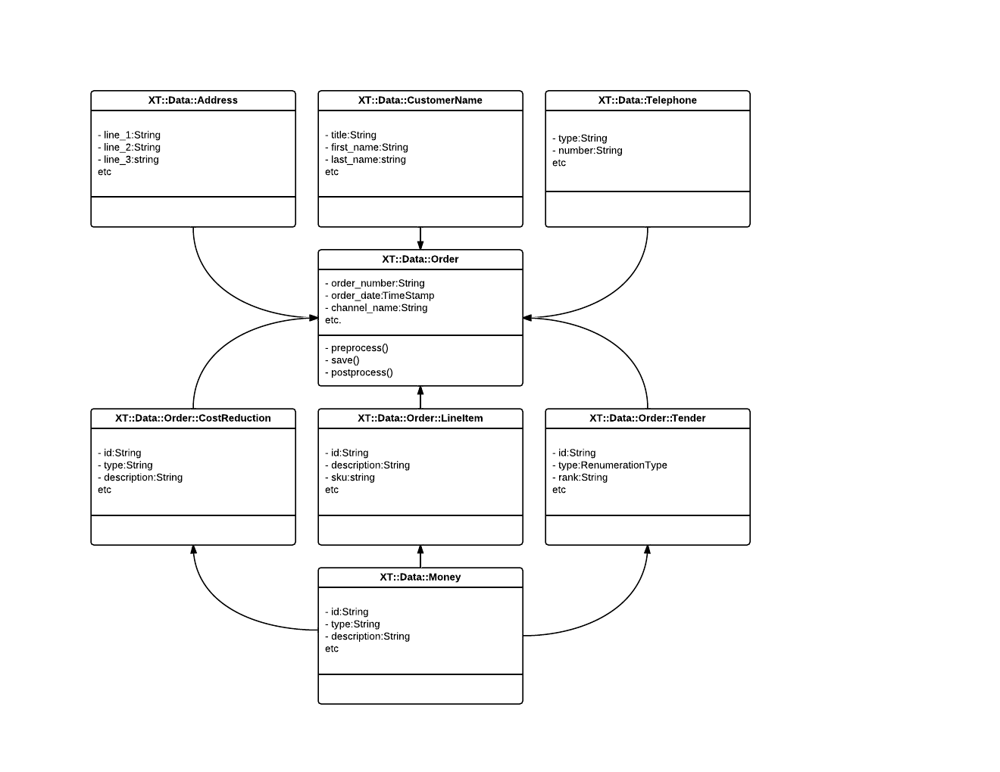

<!SLIDE>
# The greatest refactoring in the history of mankind. Maybe. #
## (AKA - rewriting the order importer) ##

<!SLIDE bullets incremental>
# What is the order importer? #

* processes orders from the websites (lots $$$)
* a beast
* hard to maintain/understand

<!SLIDE bullets incremental>
# Order Importer v2 #

* XT::Order::Parser
* XT::Order::Role::Parser
* XT::Order::Parser::PublicWebsiteXML
* XT::Order::Parser::IntegrationServiceJSON
* XT::Data::Order
* XT::Order::Importer

<!SLIDE full-page>

<!SLIDE>
# XT::Order::Parser #

    @@@ perl
    package XT::Order::Parser;

    use Module::PluginFinder;

    my $finder = Module::PluginFinder->new(
    search_path => 'XT::Order::Parser',
    filter      => sub {
        my ($class, $args) = @_;
        $class->is_parsable($args);
    }

    sub new_parser {
        my ( $class, $args ) = @_;

        # use the order data to determine which parser to construct
        # pass the full args to the parser constructor
        my $parser = $finder->construct( $args->{data}, $args );

        croak 'Parser does not conform to parser interface'
            unless $parser->meta->does_role( 'XT::Order::Role::Parser' );

        return $parser;
    }

);

<!SLIDE>

    @@@ perl
    package XT::Order::Role::Parser;
    use Moose::Roles;
    use XT::Data::Types;

    requires 'is_parsable';
    requires 'parse';

    has data => (
        required    => 1,
        is          => 'ro',
    );

    has schema => (
        is          => 'ro',
        isa         => 'DBIx::Class::Schema',
        required    => 1,
    );

    1;

<!SLIDE>

    @@@ perl
    package XT::Order::Importer

    use XT::Order::Parser;

    sub import_orders {
        my ( $self, $args ) = @_;

        croak 'Order data required' unless defined $args->{data};
        croak 'Schema required' unless defined $args->{schema};

        my $parser = XT::Order::Parser->new_parser({
            data    => $args->{data},
            schema  => $args->{schema},
        });

        my @orders = $parser->parse;
        
        for (@orders) {
            $_->digest;
        }

        return 1;
    }

    1;

<!SLIDE full-page>

